# Exercise 1

## Table of Contents

1. [Install Python](#install-python)
2. [Set Up a Virtual Environment](#set-up-a-virtual-environment)
3. [Create a Python Script](#create-a-python-script)
4. [Set Up IPython Shell](#set-up-ipython-shell)
5. [Export a Requirements File](#export-a-requirements-file)
6. [Create a Github Repo](#create-a-github-repo)

## Install Python

First, install Python 3.8.7 on your system. Check your Python version by using the command `python --version` from your terminal.

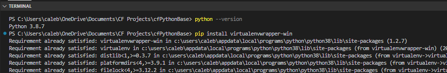

## Set Up a Virtual Environment

Set up a new virtual environment named “cf-python-base”.

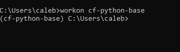

## Create a Python Script

Install Visual Studio Code or another text editor of your preference, and then create a Python script named "add.py." This script is designed to receive two numbers as user input, add them together, and display the result. Below is the template for your Python script:

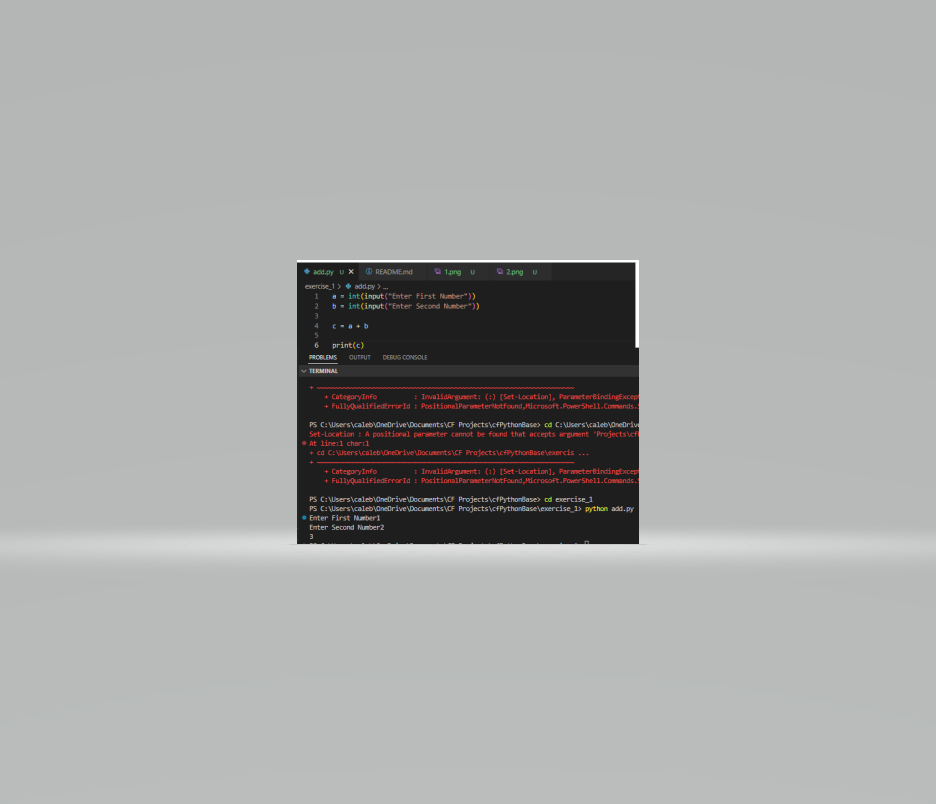

```python
a = int(input("Enter First Number"))
b = int(input("Enter Second Number"))

c = a + b

print(c)
```

## Set Up IPython Shell

To establish an IPython shell within the virtual environment "cf-python-base," you can leverage pip for installation. The IPython shell closely resembles the standard Python REPL but offers enhanced features such as syntax highlighting, auto-indentation, and robust auto-complete capabilities.

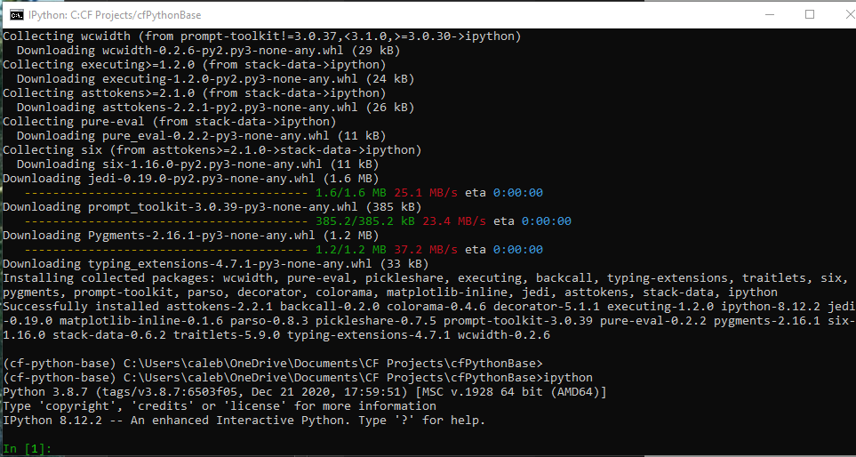

## Export a Requirements File

First, generate a “requirements.txt” file from your source environment. To do this, you use the pip freeze command and all packages (including version numbers) installed in the currently activated environment will be compiled: > pip freeze > requirements.txt.
Next, create a new environment called “cf-python-copy”. In this new environment, install packages from the “requirements.txt” file that you generated earlier. To install the packages from this file in any other environment, you run the pip install command with the extra -r argument, followed by the name of your requirements file: > pip install -r requirements.txt.

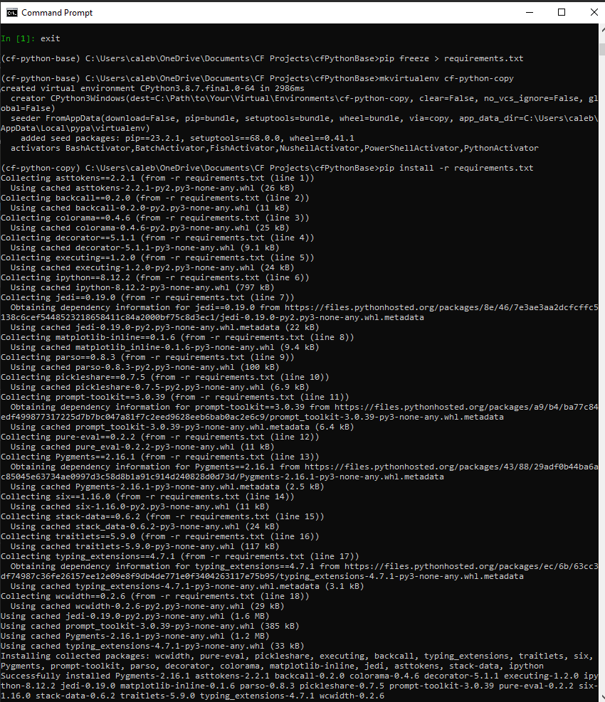

# Exercise 2

## Table of Contents

1. [Create recipe_1](#create-recipe_1)
2. [Create Outer Structure](#create-outer-structure)
3. [Create 5 More Recipes](#create-4-more-recipes)
4. [Print Ingredient Lists](#print-ingredient-lists)

## Create recipe_1

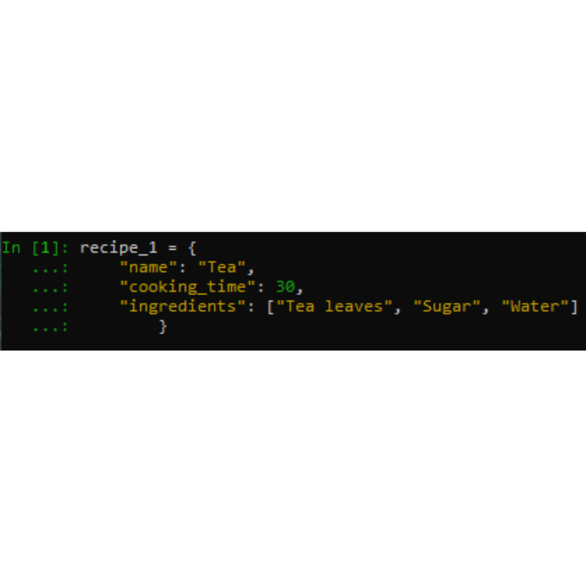

_A dictionary was chosen because it allows you to associate descriptive keys with their corresponding values. This makes it easy to access and manage different aspects of the recipe, such as the name, cooking time, and list of ingredients, in a structured and readable manner. Dictionaries are a natural choice for organizing this type of data._

## Create outer Structure

Create an outer structure called all_recipes, and then add recipe_1 to it.

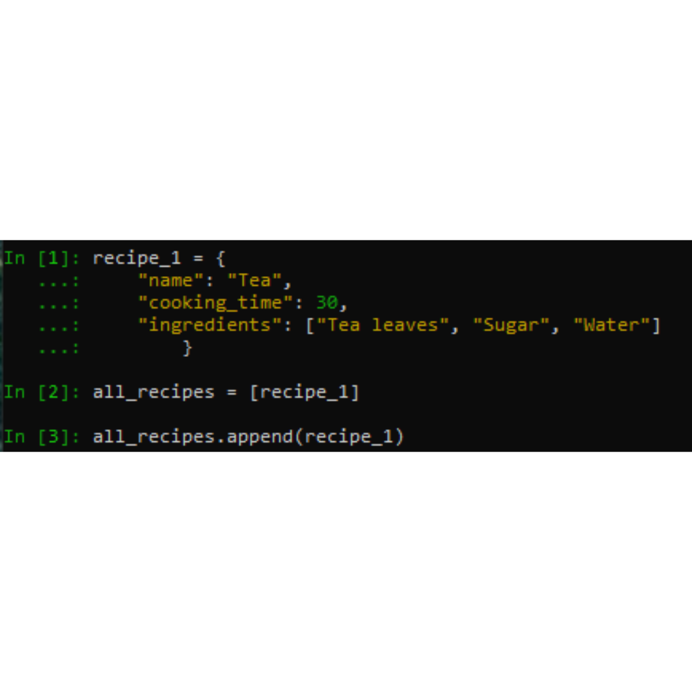

_A list gives a clear order and easy changes to recipes. It lets you work with recipes one by one or all together. Lists suit recipes of any length and complexity, making them a flexible choice for managing many recipes. In short, a list is flexible, works for many recipes, and is easy to use._

## Create 4 More Recipes

Generate 4 more recipes as recipe_2, recipe_3, recipe_4, and recipe_5, and then add them as well to all_recipes.

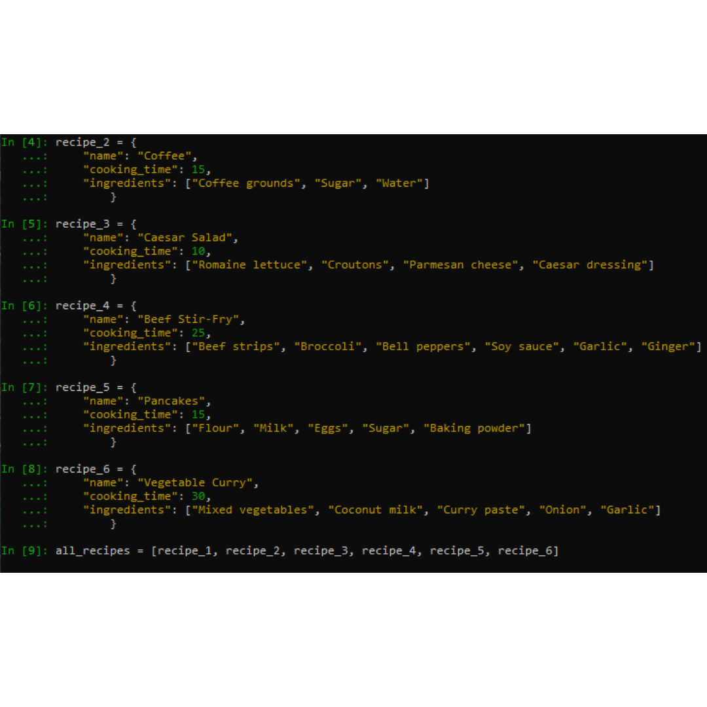

## Print Ingredient Lists

Print the ingredients of each recipe as five different lists, inside the IPython shell.

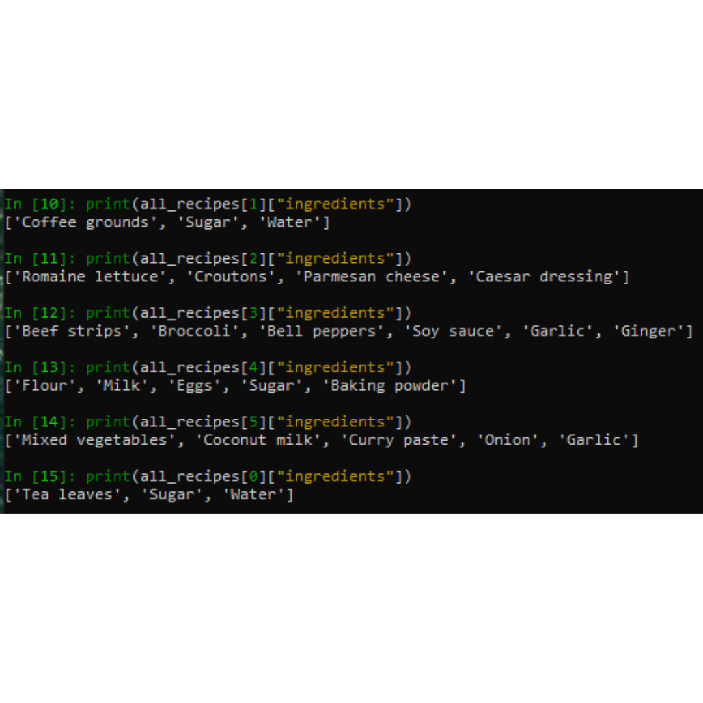

# Exercise 3

## Table of Contents

1. [Create a New Python Script](#create-a-new-python-script)
2. [Initialize Two Empty Lists](#initialize-two-empty-lists)
3. [Define a Function](#define-a-function)
4. [Get The Number of New Recipes](#get-the-number-of-new-recipes)
5. [Check Ingredients and Add Recipes](#check-ingredients-and-add-recipes)
6. [Assign Difficulty Levels and Display Recipes](#assign-difficulty-levles-and-display-recipes)
7. [Display All Ingredients](#display-all-ingredients)
8. [Show That It Works](#show-that-it-works)

## Create a New Python Script

Open a Python script in an editor of your choice and name it “Exercise_1.3.py”.


## Initialize Two Empty Lists

Initialize two empty lists: `recipes_list` and `ingredients_list`.

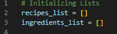

## Define a Function

Define a function called `take_recipe`. This function takes user input for the recipe's `name`, `cooking_time` (in minutes), and a list of `ingredients`. It stores these values in a dictionary called `recipe`.

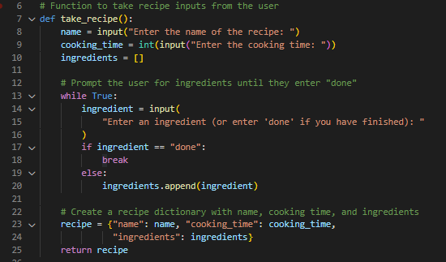

## Get the Number of New Recipes

Ask the user how many recipes they want to enter and store the response in a variable called `n`.

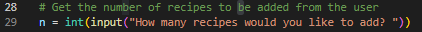

## Check Ingredients and Add Recipes

Run a loop that executes `take_recipe()` for each recipe. Inside this loop, check each ingredient and add it to the `ingredients_list` if it's not already present. Finally, append the recipe to the `recipes_list`.

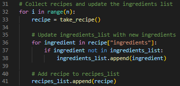

## Assign Difficulty Levels and Display Recipes

Run another loop to assign a difficulty level to each recipe based on cooking time and ingredient count. Then, display each recipe's details in a consistent format.

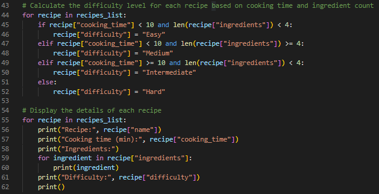

## Display All Ingredients

Display a list of all unique ingredients used across all recipes.

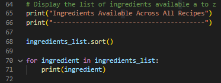

## Show That It Works

To run the script, enter the following command: `python Exercise_1.3.py`.

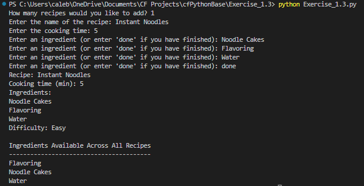
